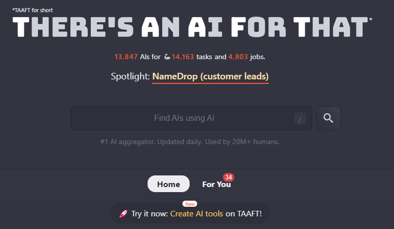

  

---

#### Contact TMHS here

  

    <h3>Facebook</h3>
    
  

  

    <h3>LinkedIn</h3>
    
  

---

---

# Top Free AI Tools

This repository provides a curated list of free AI tools that can help you enhance your productivity, creativity, and daily life. Click the buttons to explore each tool.

---

### OUR GUIDES (Links to the "tools" folder)

  

    <h3>Godmode AI</h3>
    
  

  

    <h3>UiMagic AI</h3>
    
  

  

    <h3>Crayo AI</h3>
    
  

  

    <h3>HubSpot</h3>
    
  

  

    <h3>Zendesk</h3>
    
  

  

    <h3>Tableau</h3>
    
  

  

    <h3>Zapier</h3>
    
  

## Video Enhancement Tools

### 
Gling is an AI-powered video editing tool designed to help YouTube creators save time and improve their content. It offers automatic cuts, scene detection, and other features to streamline video editing.

### 
FlexClip is a free online video editor and maker tool that allows users to create professional-looking videos with ease. It includes a range of templates, stock videos, and music options.

## Deal Finders

### 
This AI tool helps users find the best deals on tires by comparing prices and offers from various retailers.

### 
Designed to search and provide the best deals and coupons for any product, this AI tool is useful for online shoppers looking to save money.

## Image Generators

### 
Dioptify is a creative AI tool for enhancing, refining, and transforming images. It automates the image editing process to produce high-quality results.

### 
This tool offers text-to-image generation, enabling users to create images based on text prompts with various styles and customization options.

## Coding Tools

### 
DeepCode uses AI to analyze your code and provide suggestions for improving code quality, security, and performance.

### 
TabNine is an AI-powered autocompletion tool that integrates with various IDEs to provide intelligent code suggestions.

### 
Kite is an AI-powered coding assistant that integrates with your IDE to provide advanced code completions and documentation lookups.

### 
CodeT5 is a free open-source code generation model that can help with code completion and generation tasks.

## Additional Tools

### 
Topaz Video AI enhances video quality by using AI to upscale, de-noise, and improve video clarity.

### 
Fix Blur is a free AI-powered tool designed to enhance blurry pictures, especially focusing on human faces.

### 
iMyFone UltraRepair provides a one-stop solution for repairing broken, blurry, and corrupted files.

### 
An AI Video Editor that uses AI technology to transform videos effortlessly.

### 
Rentoor is an AI-powered tool to enhance old and blurry face photos using advanced technology.

### 
EbSynth is an AI-powered video editing tool that enables users to transform footage by painting over individual frames.

### 
Deep Image is an AI photo enhancer that improves the quality of images using advanced algorithms.

---

### Repository Stats

### Account Stats

---

## How to Use

1. Click the buttons to explore the AI tools.
2. Sign up or start using the tools directly on their respective websites.
3. Enjoy the benefits of these free AI-powered tools!

## Contributing

If you know of any other free AI tools that should be included in this list, please open an issue or submit a pull request with the details.

## License

This project is licensed under the MIT License - see the [LICENSE](LICENSE) file for details.
